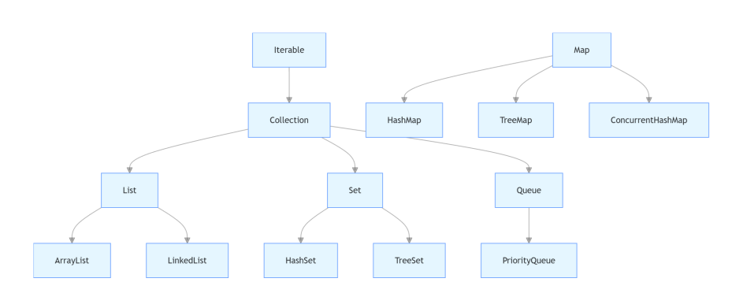

# Java集合：深入理解与实用指南

在Java开发领域，集合框架是极为核心的部分，它为开发者提供了一系列丰富的数据结构与算法，用于高效地存储、检索及操作数据。无论是小型的桌面应用，还是大型复杂的企业级项目，Java集合框架都发挥着不可或缺的作用。接下来，我们将全面且深入地探讨Java集合的常用知识点与实用技巧。

## 一、Java集合框架概述
Java集合框架犹如一座精心构建的大厦，主要由接口（Interfaces）、实现类（Implementing Classes）以及算法（Algorithms）这三大基石构成。接口像是大厦的设计蓝图，清晰地定义了集合应具备的行为规范；实现类则如同大厦的实际建筑材料，依据接口的规范提供了具体的数据结构实现；而算法则如同大厦内部的各种设施，用于对集合中的数据进行各类操作。

Java集合框架从宏观上大致可划分为两类：
1. **Collection接口体系**：作为所有集合类的根源接口，它继承自Iterable接口。这就好比一棵大树的主干，Collection接口又进一步衍生出三个主要的子接口分支：List、Set和Queue，各自承载着不同的功能特性。
2. **Map接口体系**：它独树一帜，用于存储键值对（key - value pairs），与Collection接口并无继承关系，像是大厦中独立的一个功能区域。

### Java集合框架体系图



## 二、List集合
### 1. ArrayList
- **特点**：基于数组实现，就像在一块连续的土地上整齐排列着元素。它允许元素重复出现，并且元素的顺序与插入顺序保持一致。ArrayList最大的优势在于支持随机访问，这意味着可以像在一排房子中直接找到指定门牌号的房子一样迅速获取元素，查询效率极高。然而，当需要在中间位置插入或删除元素时，就好比要在一排紧密排列的房子中间拆除或新建一栋房子，需要移动大量其他元素，效率相对较低。
- **使用场景**：在那些需要频繁查询数据，但插入和删除操作相对较少的场景中，ArrayList是不二之选。例如，在一个分页展示大量数据的系统中，每次查询特定页面的数据时，ArrayList能够快速定位并提供所需数据。

```java
List<String> arrayList = new ArrayList<>();
arrayList.add("element1");
arrayList.add("element2");
String element = arrayList.get(0);
```

### 2. LinkedList
- **特点**：基于链表实现，每个元素就像一个个独立的小房间，通过指针相互连接。同样允许元素重复且保持插入顺序。LinkedList在插入和删除操作上展现出独特的优势，因为只需调整相邻房间之间的连接指针，无需像ArrayList那样大规模移动其他元素，效率显著提高。但在随机访问时，由于没有像数组那样直接定位的能力，需要从链表头开始逐个寻找，如同在一条长长的小巷中逐个寻找特定的房子，效率较低。
- **使用场景**：当项目中频繁涉及到插入和删除操作时，LinkedList就大显身手了。比如在实现栈或队列这种数据结构时，元素的进出频繁，LinkedList能够高效地处理这些操作。

```java
List<String> linkedList = new LinkedList<>();
linkedList.add("element1");
linkedList.add("element2");
linkedList.remove(0);
```

## 三、Set集合
### 1. HashSet
- **特点**：基于哈希表实现，仿佛是一个有着特殊收纳规则的仓库。它不允许元素重复，就像仓库里不允许有两件完全一样的物品。并且元素是无序的，存放的顺序并不固定。HashSet通过计算元素的哈希码来确定其在仓库中的存储位置，就像给每个物品分配一个特定的货架位置，因此查询效率非常高，能够快速定位到所需元素。
- **使用场景**：当我们只关心元素是否存在，而不关心其顺序时，HashSet是绝佳选择。例如，在数据去重的场景中，它能快速筛选出重复元素并只保留一份。

```java
Set<String> hashSet = new HashSet<>();
hashSet.add("element1");
hashSet.add("element2");
boolean contains = hashSet.contains("element1");
```

### 2. TreeSet
- **特点**：基于红黑树实现，这是一种自平衡的二叉搜索树结构。如同一个有着严格排序规则的书架，TreeSet不允许元素重复，且元素会按照自然顺序（如果元素实现了Comparable接口）或自定义顺序（通过传入Comparator实现）进行排序。在插入和查询操作上，它的性能相对较为平衡，既不像ArrayList在插入删除时那么低效，也不像HashSet在查询时那样极致快速。
- **使用场景**：当需要对集合中的元素进行排序，并且确保元素的唯一性时，TreeSet是很好的选择。比如在对学生成绩进行排序并去重的场景中，TreeSet能完美胜任。

```java
Set<Integer> treeSet = new TreeSet<>();
treeSet.add(3);
treeSet.add(1);
treeSet.add(2);
// 输出结果为1, 2, 3
System.out.println(treeSet);
```

## 四、Queue集合
### 1. PriorityQueue
- **特点**：基于堆数据结构实现，可看作是一个有着优先级区分的任务队列。元素按照自然顺序或自定义顺序排序，每次从队列中取出的元素是优先级最高的元素，就像在一堆任务中，总是优先处理最重要的任务。
- **使用场景**：在需要按照优先级处理任务的场景中，PriorityQueue能发挥巨大作用。例如在任务调度系统中，高优先级的任务会被优先执行。

```java
Queue<Integer> priorityQueue = new PriorityQueue<>();
priorityQueue.add(3);
priorityQueue.add(1);
priorityQueue.add(2);
// 输出结果为1
System.out.println(priorityQueue.poll());
```

## 五、Map集合
### 1. HashMap
- **特点**：基于哈希表实现，如同一个有着独特索引方式的仓库，用于存储键值对。它允许null键和null值，元素是无序的。HashMap凭借其高效的哈希算法，在查询和插入操作上具有出色的性能，能够快速定位和存储键值对。但在多线程环境下，由于多个线程可能同时修改哈希表结构，会导致数据不一致等问题，所以它不是线程安全的。
- **使用场景**：在大多数需要快速查找和插入键值对的场景中，HashMap是首选。例如在缓存数据时，通过键快速获取对应的值，提高系统性能。

```java
Map<String, Integer> hashMap = new HashMap<>();
hashMap.put("key1", 1);
hashMap.put("key2", 2);
Integer value = hashMap.get("key1");
```

### 2. TreeMap
- **特点**：基于红黑树实现，如同一个有序的字典，按键的自然顺序或自定义顺序对键值对进行排序。它不允许null键，值可以为null。TreeMap在需要按键的顺序处理键值对时表现出色，比如按时间顺序存储事件记录，通过键的排序可以方便地进行查找和遍历。
- **使用场景**：当对数据的顺序有要求，且需要按键进行排序和操作时，TreeMap是合适的选择。例如在统计不同时间段内的用户访问量，并按时间顺序展示时，TreeMap能满足需求。

```java
Map<String, Integer> treeMap = new TreeMap<>();
treeMap.put("c", 3);
treeMap.put("a", 1);
treeMap.put("b", 2);
// 输出结果为{a=1, b=2, c=3}
System.out.println(treeMap);
```

### 3. ConcurrentHashMap
- **特点**：线程安全的哈希表，是多线程环境下的高效选择。它允许多个线程同时读取，部分线程同时写入。在JDK 1.7及之前，采用分段锁机制，将数据分成多个段（Segment），每个段有自己的锁，不同段的操作可以并发执行，大大提高了并发性能。JDK 1.8之后，采用CAS（Compare - and - Swap）操作和synchronized关键字来保证线程安全，同时引入红黑树优化性能，进一步提升了在高并发场景下的效率。
- **使用场景**：在多线程环境下，当需要高效地进行并发读写操作时，ConcurrentHashMap是不二之选。比如在多线程环境下的缓存系统中，多个线程可能同时读取和写入缓存数据，ConcurrentHashMap能够保证数据的一致性和操作的高效性。

```java
ConcurrentMap<String, Integer> concurrentHashMap = new ConcurrentHashMap<>();
concurrentHashMap.put("key1", 1);
concurrentHashMap.putIfAbsent("key2", 2);
```

## 六、Java集合相关面试题及答案

### 1. ArrayList和LinkedList的区别？
**答案**：ArrayList基于数组实现，支持随机访问，查询效率高，但插入和删除元素时可能需要移动大量元素，效率较低。LinkedList基于链表实现，插入和删除操作只需修改指针，效率高，但随机访问需要从头遍历链表，效率低。从数据结构角度看，ArrayList是连续的内存空间存储元素，而LinkedList是通过指针连接分散的节点。在实际应用中，根据操作特点选择合适的List实现类，若查询频繁选ArrayList，若插入删除频繁则选LinkedList。

### 2. HashSet如何保证元素的唯一性？
**答案**：HashSet通过哈希码（hashCode）和equals方法来保证元素唯一性。当向HashSet添加元素时，首先计算元素的哈希码，以此确定其在哈希表中的存储位置。如果该位置没有元素，则直接添加。若该位置已有元素，就调用equals方法比较新元素与已有元素的内容。若内容相同，则不添加；若不同，则添加。这就好比在一个仓库中，先根据物品的特征分配一个大致的区域（哈希码确定位置），如果该区域已有物品，再仔细比较新物品与已有物品是否完全一样（equals方法比较内容），一样则不存放，不一样才存放。

### 3. TreeSet如何对元素进行排序？
**答案**：TreeSet可以通过两种方式对元素排序。一是元素自身实现Comparable接口，定义自然顺序。例如，一个自定义的Student类实现Comparable接口，按照成绩或学号等属性进行自然排序。二是在创建TreeSet时传入一个Comparator接口的实现类，自定义排序规则。比如，可以根据学生的年龄或者名字的字母顺序等自定义规则进行排序。

### 4. HashMap和TreeMap的区别？
**答案**：HashMap基于哈希表实现，无序，允许null键和null值，查询和插入效率高，适用于大多数需要快速查找和插入键值对的场景。TreeMap基于红黑树实现，按键的顺序排序，不允许null键，适用于需要按键排序的场景，如按时间顺序存储事件记录。简单来说，HashMap像一个快速查找的仓库，不关心物品顺序；而TreeMap像一个有序的书架，按照一定顺序摆放物品（键）。

### 5. ConcurrentHashMap是如何实现线程安全的？
**答案**：在JDK 1.7及之前，ConcurrentHashMap采用分段锁机制。它将数据分成多个段（Segment），每个段就像一个独立的小仓库，有自己的锁。不同段的操作可以并发执行，这样在多线程环境下，只要不同线程操作的是不同段的数据，就不会产生冲突，大大提高了并发性能。到了JDK 1.8之后，ConcurrentHashMap采用CAS（Compare - and - Swap）操作和synchronized关键字来保证线程安全。CAS操作用于无锁的原子性更新，而synchronized关键字则用于对一些可能产生竞争的关键代码块进行同步控制。同时，引入红黑树优化性能，当链表长度过长时，转换为红黑树，提高查找效率，进一步适应高并发场景。

### 6. 如何在多线程环境下安全地使用ArrayList？
**答案**：有两种常见方式。一是使用Collections.synchronizedList(new ArrayList<>())方法将ArrayList包装成线程安全的列表。这种方式是在ArrayList外面套了一层同步的外壳，对列表的所有操作都通过这个外壳进行同步控制。二是使用CopyOnWriteArrayList，它的原理是在修改操作（如添加、删除元素）时，会复制一份新的数组，在新数组上进行修改操作，而读操作则在原数组上进行。这样就保证了读操作不会受到写操作的影响，从而实现线程安全。但由于每次写操作都要复制数组，所以在写操作频繁的场景下性能可能会受到影响。

### 7. 解释一下迭代器（Iterator）的作用和使用方法？
**答案**：迭代器用于遍历集合中的元素，为开发者提供了一种统一的方式来访问集合元素，而无需关心集合的具体实现。使用时，首先通过集合的iterator()方法获取迭代器，这就像是拿到了一把可以在集合这个“大房子”里逐个房间查看的钥匙。然后使用hasNext()方法判断是否还有下一个元素，如同查看是否还有下一个房间可看。接着通过next()方法获取下一个元素，就像进入下一个房间并查看里面的物品。如果需要删除当前元素，可以使用remove()方法。

```java
List<String> list = new ArrayList<>();
list.add("a");
list.add("b");
Iterator<String> iterator = list.iterator();
while (iterator.hasNext()) {
    String element = iterator.next();
    if ("a".equals(element)) {
        iterator.remove();
    }
}
```

### 8. 什么情况下会导致HashMap的性能下降？
**答案**：当哈希冲突过多时，HashMap的性能会显著下降。哈希冲突是指不同的元素计算出了相同的哈希码，导致它们被分配到哈希表的同一个位置（桶），形成链表。这可能发生在以下几种情况：一是初始容量过小，就像仓库的空间一开始就很小，物品很容易挤在同一区域；二是负载因子过大，负载因子是衡量哈希表中元素填满程度的指标，过大意味着哈希表快满了，更容易产生冲突；三是哈希函数设计不合理，不能均匀地将元素分配到不同位置。哈希冲突过多会使链表变长，原本查询和插入操作时间复杂度从理想的O(1)退化为O(n)，n为链表长度，性能大幅降低。

### 9. Queue接口的常见实现类有哪些，它们的特点是什么？
**答案**：常见实现类有PriorityQueue和LinkedList。PriorityQueue基于堆结构，元素按优先级排序，每次取出的是优先级最高的元素，适用于任务调度等需要按优先级处理元素的场景。LinkedList既实现了List接口，也实现了Queue接口，支持FIFO（先进先出）队列操作，同时还支持双端队列（Deque）操作，在插入和删除元素方面效率较高，适用于需要频繁进行队列操作的场景。

### 10. List、Set和Map接口的主要区别是什么？
**答案**：List接口允许元素重复，有序（插入顺序），就像一个有序的清单，可以有重复的项目。Set接口不允许元素重复，部分实现类无序（如HashSet），部分有序（如TreeSet），类似一个去重的集合。Map接口存储键值对，键不能重复，部分实现类无序（如HashMap），部分有序（如TreeMap），如同一个字典，通过键来查找对应的值。List和Set继承自Collection接口，而Map与Collection没有继承关系，它们在数据存储和访问方式上有着明显的差异，开发者需根据实际需求选择合适的接口及其实现类。 