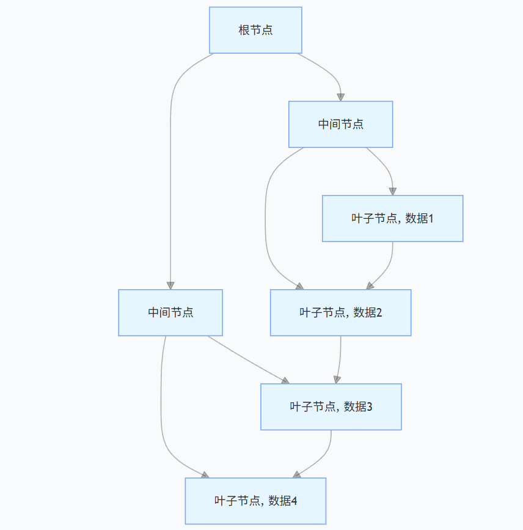

# MySQL索引：原理、类型与优化策略

在MySQL数据库管理中，索引是提升查询性能的关键要素。它如同书籍的目录，帮助数据库快速定位所需数据，避免全表扫描带来的性能开销。本文将深入探讨MySQL索引的核心知识，涵盖原理、类型以及优化策略，助力开发者构建高性能的数据库应用。

## 一、索引原理
MySQL索引基于数据结构实现，常见的是B - Tree（B树）及其变种B + Tree。以B + Tree为例，它是一种平衡多路搜索树，所有数据都存储在叶子节点，并且叶子节点通过双向链表相连。这种结构特点使得范围查询和顺序访问更为高效。

当执行查询语句时，MySQL从根节点开始，根据索引列的值与节点中的值进行比较，决定向下遍历的路径。例如，在一个按年龄建立索引的表中查询年龄为30的用户，数据库会从B + Tree根节点开始，逐步找到叶子节点中年龄为30的数据记录。

### B + Tree索引结构示意图



## 二、索引类型
### 1. 普通索引
这是最基本的索引类型，它没有任何限制，允许在定义索引的列中插入重复值和NULL值。普通索引的主要作用是加快对数据的访问速度，适用于对单个列进行快速查找的场景。

```sql
-- 创建普通索引
CREATE INDEX idx_column_name ON table_name (column_name);
```

### 2. 唯一索引
唯一索引要求索引列中的值必须唯一，但允许为NULL（前提是列定义允许NULL）。唯一索引不仅能加速查询，还能保证数据的唯一性。常用于身份证号、邮箱地址等具有唯一性的字段。

```sql
-- 创建唯一索引
CREATE UNIQUE INDEX idx_unique_column ON table_name (unique_column);
```

### 3. 主键索引
主键索引是一种特殊的唯一索引，一个表只能有一个主键索引，且主键列的值不能为空。主键索引用于唯一标识表中的每一行数据，对数据的完整性至关重要。在创建表时，可以直接定义主键。

```sql
-- 创建表时定义主键
CREATE TABLE table_name (
    id INT PRIMARY KEY,
    column1 VARCHAR(255),
    column2 INT
);
```

### 4. 组合索引
组合索引是基于多个列创建的索引。当查询条件涉及多个列时，组合索引能显著提高查询效率。在使用组合索引时，遵循“最左前缀原则”，即查询条件要从索引定义的最左边列开始使用，否则索引可能失效。

```sql
-- 创建组合索引
CREATE INDEX idx_multiple_columns ON table_name (column1, column2, column3);
```

## 三、索引优化策略
### 1. 避免索引失效
- **函数操作**：对索引列使用函数操作会导致索引失效。例如，`SELECT * FROM users WHERE UPPER(name) = 'JOHN';`，此时`name`列上的索引无法使用。应尽量避免在索引列上使用函数，改为`SELECT * FROM users WHERE name = 'john';`
- **数据类型不匹配**：如果查询条件中的数据类型与索引列的数据类型不一致，也会使索引失效。比如索引列是`INT`类型，而查询时使用了字符串，如`SELECT * FROM users WHERE age = '30';`，应确保数据类型一致`SELECT * FROM users WHERE age = 30;`

### 2. 合理使用覆盖索引
覆盖索引是指查询所需要的数据列都包含在索引中，这样数据库无需回表查询数据，直接从索引中获取结果，大大提高查询效率。例如，`SELECT id, name FROM users WHERE age = 30;`，如果在`(age, id, name)`上创建组合索引，就可以利用覆盖索引优化查询。

### 3. 定期维护索引
随着数据的插入、更新和删除，索引可能会变得碎片化，影响查询性能。定期使用`OPTIMIZE TABLE`或`ALTER TABLE`语句对表进行优化，可以重新组织索引数据，提高索引的效率。

```sql
-- 优化表结构及索引
OPTIMIZE TABLE table_name;
```

## 四、索引相关面试题及答案

### 1. 索引为什么能提高查询性能？
**答案**：索引基于特定的数据结构（如B + Tree）存储，通过对数据进行有序组织，减少了数据的查找范围。当执行查询时，数据库可以利用索引快速定位到目标数据所在位置，避免全表扫描，从而大幅提高查询性能。

### 2. 什么情况下索引会失效？
**答案**：如前文所述，在索引列上使用函数操作、数据类型不匹配、不符合组合索引的最左前缀原则、使用`OR`连接条件（除非每个条件列都有索引）以及查询条件中有`LIKE '%value'`（即通配符在开头）等情况，都可能导致索引失效。

### 3. 主键索引和唯一索引有什么区别？
**答案**：主键索引是特殊的唯一索引，一个表只能有一个主键索引，且主键列值不能为空，用于唯一标识表中的每一行数据，保证数据的完整性。唯一索引允许列值为NULL（前提是列定义允许），一个表可以有多个唯一索引，主要确保索引列值的唯一性，同时也能提升查询效率。

### 4. 组合索引的最左前缀原则是什么？
**答案**：组合索引的最左前缀原则指的是在使用组合索引时，查询条件要从索引定义的最左边列开始使用，MySQL才会使用该组合索引。例如，在组合索引`(col1, col2, col3)`上，`SELECT * FROM table WHERE col1 = 'value1' AND col2 = 'value2';` 可以使用索引，而 `SELECT * FROM table WHERE col2 = 'value2';` 则可能导致索引部分或完全失效。

### 5. 覆盖索引是如何工作的？
**答案**：覆盖索引是指查询所需的所有列都包含在索引中。当执行查询时，MySQL无需再回表获取数据，直接从索引树的叶子节点中就能获取到结果集，减少了磁盘I/O操作，从而提高查询性能。例如查询 `SELECT id, name FROM users WHERE age = 30;`，若在`(age, id, name)`上创建组合索引，即可利用覆盖索引优化查询。

### 6. 如何判断一个查询是否使用了索引？
**答案**：可以使用`EXPLAIN`关键字，它会显示MySQL如何执行查询语句。在`EXPLAIN`的输出结果中，`key`列表示MySQL实际使用的索引，如果该列为`NULL`，则说明未使用索引；如果显示具体的索引名，则表示使用了相应索引。

```sql
EXPLAIN SELECT * FROM users WHERE age = 30;
```

### 7. 索引越多越好吗？
**答案**：并非如此。虽然索引能提升查询性能，但过多的索引也会带来负面影响。一方面，索引会占用额外的存储空间，随着数据量的增大，这部分空间开销不容忽视。另一方面，在插入、更新和删除数据时，数据库需要同时更新索引，这会增加操作的时间开销，降低写入性能。因此，应根据实际查询需求，合理创建索引。

### 8. 前缀索引是什么，有什么作用？
**答案**：前缀索引是对列的前几个字符创建索引。例如，对一个很长的字符串列`description`，可以只对前10个字符创建索引 `CREATE INDEX idx_description ON table_name (description(10));`。其作用在于当列值较长时，使用前缀索引既能减少索引占用的空间，又能在一定程度上提高查询性能，适用于对长字符串列进行部分匹配查询的场景。

### 9. 聚簇索引和非聚簇索引有什么区别？
**答案**：聚簇索引中，数据行的物理顺序与索引顺序一致，即数据存储在索引的叶子节点上。一个表只能有一个聚簇索引，通常主键索引就是聚簇索引。聚簇索引对于范围查询和排序操作非常高效。非聚簇索引的数据存储与索引是分开的，索引的叶子节点存储的是数据的物理地址或主键值，通过索引找到数据需要进行一次额外的I/O操作（回表）。一个表可以有多个非聚簇索引。非聚簇索引适用于对单个列进行快速查找的场景。

### 10. 如何优化索引以提高数据库性能？
**答案**：首先要合理设计索引，避免创建过多不必要的索引。遵循最左前缀原则创建组合索引，确保查询条件能有效利用索引。避免索引失效的情况，如不在索引列上使用函数、保证数据类型匹配等。利用覆盖索引减少回表操作，定期维护索引以减少碎片化。同时，结合`EXPLAIN`等工具分析查询计划，根据实际情况调整索引策略。 